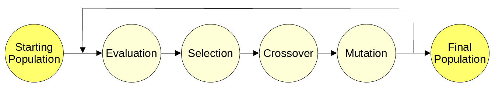

# simple-genetic-algorithm
A basic implementation of a genetic algorithm with the goal to find optimal solutions for the Knapsack problem.

As a basis for an individual integer sequences are used, which allows an adaptation to further problems, provided that possible solutions can be encoded as a series of integers.

## Basic concept
Genetic algorithms try to find solutions for a problem by mimicing the process of evolution. The main idea is that a solution consists of a sequence of numerical values representing a genome. The environment is represented by an evaluation function (e.g. accuracy or maximum output). A group of such solutions is called population. While running the algorithm, populations are replaced by their children, which were generated using the concepts of crossover and mutation until some criteria for stopping the evolution is met. This process is shown in the image below:

- **Starting Population:** The first population is randomly initialised with each value in the sequence laying between given bounds.
- **Evaluation:** The evaluation function, also known as fitness function, is applied to each individual solution within the population to calculate how good they perform in the environment. The result is the fitness of the individual.
- **Selection:** The parents for the new population are selected. There are multiple ways of doing this. In general there is a trade-off between including only the best solutions for a better starting fitness of the child population and including many of the worse individuals for an increased diversity.
- **Crossover:** The concept of crossover is applied, meaning that the values of 2 parents are mixed to create 2 new children different than the parents.
- **Mutation:** The values of the solutions are randomly modified to create values for solutions which were not included in the original population and to account for a decreased diversity in the gene pool.
- **Final Population:** The final population is the population which has been generated after a set amount of maximum iterations or in which the best solution has achieved a fitness which has been set as good enough.

## Selection Methods
As stated before, all selection methods are a trade-off between fitness and loss in the gene pool. That is why there is not *the* selection method but rather a collection of methods. This repository contains 3 implementations: truncation selection, tournament selection, and fitness proportionate selection.
- **Truncation selection:** From a population of n individuals only the m best can be chosen to be a parent. Every member of this subgroup has the same probability of 1/m to be chosen. Since this method only uses the best individuals it sacrifices the diversity of the gene pool.
- **Fitness proportionate selection:** Every member of the whole population has the chance to be chosen. However, those who have a higher fitness are preferred over those with a lower fitness. This is achieved by assigning each individual the probability *p = fitnessindividual / fitnesstotal* 
- **Tournament selection:** For each individuum in the child population a tournament with m members is held. The probability of being selected for a tournament is equal for all members of the parent population (*p = 1/n*). The winner of the tournament is chosen randomly but the process prefers the ones with a higher fitness and assigns the probability of being the winner based on the fitness rank in the tournament subgroup.